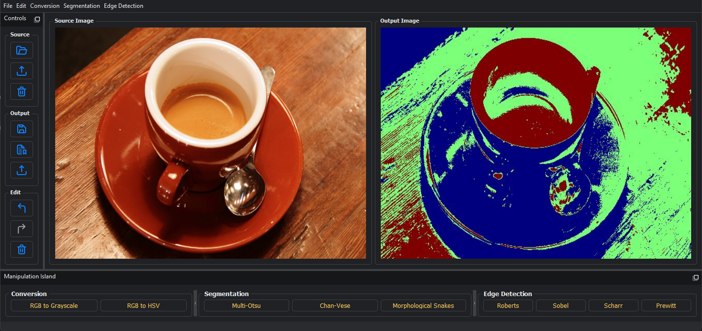

# Image Manipulation
 An image manipulation app with UI developed in Python and PyQt5 for my Object Oriented Programming II class

--- 

### Documentation
The project documentation can be found in the documentation folder in current directory. This documentation is auto generated by Doxygen and focuses on the class hierarchy. 

You can open the documentation in any web browser with Javascript enabled by opening the “index.html” file.

---

### Prerequisites
You need libraries listed down below to run.

- [PyQt5](https://pypi.org/project/PyQt5/)
- [qdarktheme](https://pyqtdarktheme.readthedocs.io/en/stable/)
- [NumPy](https://numpy.org/)
- [Scikit-Image](https://scikit-image.org/)
- [Matplotlib](https://matplotlib.org/)

---

### Run & Configuration
In the project, various libraries such as PyQt5, Scikit Image, NumPy, Matplotlib and like are used. To run the project as is, the virtual environment (venv) with all the libraries pre-installed attached in the current directory. 
Simply open the current directory in any code editor (in modern editors the virtual environment will be detected automatically), choose the virtual environment as your interpreter and run the “MainUI.py” file. 

__Important:__ Please do not move or make any changes in the virtual environment. With Python 3.4+, the python interpreter’s path is hardcoded in the “activate.bat” file and making any changes with the virtual environment will result in undefined interpreter path. If something erroneous happens while trying to run, you can choose to create a new virtual environment and install the dependencies.

---

### Design & Usage
While developing the project, I focused on the user-friendly GUI approach and tried to create modern UI elements. 
Two primary colors are used to contrast and create ease-to-eye color palette. These primary colors’ hex codes can be seen below
- #1182FF
- #FCCD60

When the user runs the application, an interface divided into two main components welcomes the user, named
- Source Image
- Output Image

In addition to these components, there are two dynamic dock widgets which are floatable, moveable and dockable, named
- Controls Island
- Manipulation Island

Aside from functionalities, there are two additional windows, named
- About Window
- Preferences Window

About Window contains a tiny bit of information about the project, Preferences Window contains user preferences in application-wide such as:
- Theme: three options: dark, light, auto (sync to current OS’s theme preference), 
- Font and Font Size, 
- Control Island’s Position and Width Lock, 
- Manipulation Island’s Position and Height Lock, and a 
- Tip label.

These preferences can be changed anytime and however the user wants. Any changes in the Preferences Window will be applied application-wide.

---

### Functionalities
You can choose any image with the extensions __'.jpg'__ or __'.png'__ by clicking __"Open Source"__ button or menu action. Your image will be shown in the __"Source Image"__ groupbox. After choosing an image, your __"Conversion, Segmentation and Edge Detection"__ buttons and menu actions will be enabled. You can choose any operation to apply to your source image.

Some other functionalities include:
- You can __Export__ your source or your output image
- You can __Save__ or __Save As__ your output image
- You can __Clear__ your source image, this will trigger the clear output functionality as well
- You can __Clear__ your output image
- You can __Undo__ or __Redo__ your operations to the output image

---

### Issues Faced During Development
Most of the issues faced during the implementation of the functionalities such as Conversion, Segmentation and Edge Detection. Incompatible source images caused the functions to break. By implementing try-except approach, the breakage of functions are prevented. 

Thanks to the Qt Designer, the design of the application went smoothly. Adding layouts for responsive application to appropriate places allowed flexible windows. 

An important thing to note is; creating a flowchart and going through a comprehensive planning process, iterating and consistent work helped me to properly structure the project.